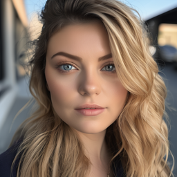
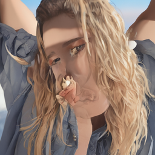
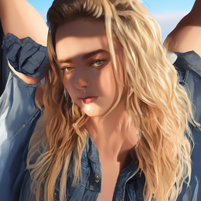
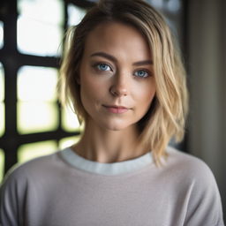
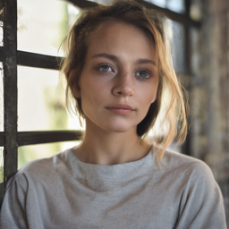
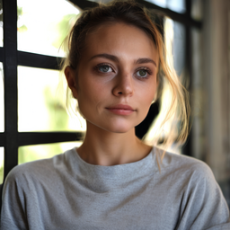
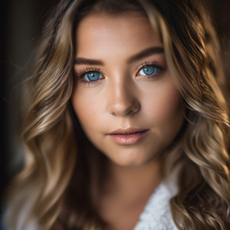
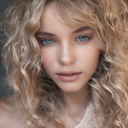
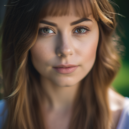

# Prediction boost for Stable Diffusion
Modify noise prediction to make image brighter and sharper on Stable Diffusion.

# Code
```
                # prediction boost
                if self.do_classifier_free_guidance:
                    _, xt = latent_model_input.chunk(2)
                else:
                    xt = latent_model_input
                    noise_pred_text = noise_pred

                def _projection(u, v):
                    uv = torch.mean(u * v, dim=[1, 2, 3], keepdim=True)
                    vv = torch.mean(v ** 2, dim=[1, 2, 3], keepdim=True) + 1.0e-05
                    return (uv / vv) * v

                noise_pred = noise_pred - boost_scale * (xt - _projection(xt, noise_pred_text))
```

# Result
- model: stabilityai/stable-diffusion-xl-base-1.0
- num_inference_steps: 30
- prompt: "portrait, natural light, ultra detailed"
- negative_prompt: "unknown author, random sketch"
- seed: 42

| CFG=10 | CFG=2.5 | CFG=2.5, boost=0.125 |
|:-------------------------:|:-------------------------:|:-------------------------:|
| [](samples/portrait/s0_c0_cfg10_30steps.png) | [](samples/portrait/s0_c1_cfg3_30steps.png) | [](samples/portrait/s0_c2_cfg3boost_30steps.png) |
| [](samples/portrait/s1_c0_cfg10_30steps.png) | [](samples/portrait/s1_c1_cfg3_30steps.png) | [](samples/portrait/s1_c2_cfg3boost_30steps.png) |
| [](samples/portrait/s2_c0_cfg10_30steps.png) | [](samples/portrait/s2_c1_cfg3_30steps.png) | [](samples/portrait/s2_c2_cfg3boost_30steps.png) |
| [](samples/portrait/s3_c0_cfg10_30steps.png) | [](samples/portrait/s3_c1_cfg3_30steps.png) | [](samples/portrait/s3_c2_cfg3boost_30steps.png) |
| [](samples/portrait/s4_c0_cfg10_30steps.png) | [](samples/portrait/s4_c1_cfg3_30steps.png) | [](samples/portrait/s4_c2_cfg3boost_30steps.png) |
| [](samples/portrait/s5_c0_cfg10_30steps.png) | [](samples/portrait/s5_c1_cfg3_30steps.png) | [](samples/portrait/s5_c2_cfg3boost_30steps.png) |
| [](samples/portrait/s6_c0_cfg10_30steps.png) | [](samples/portrait/s6_c1_cfg3_30steps.png) | [](samples/portrait/s6_c2_cfg3boost_30steps.png) |
| [](samples/portrait/s7_c0_cfg10_30steps.png) | [](samples/portrait/s7_c1_cfg3_30steps.png) | [](samples/portrait/s7_c2_cfg3boost_30steps.png) |
| [](samples/portrait/s8_c0_cfg10_30steps.png) | [](samples/portrait/s8_c1_cfg3_30steps.png) | [](samples/portrait/s8_c2_cfg3boost_30steps.png) |
| [](samples/portrait/s9_c0_cfg10_30steps.png) | [](samples/portrait/s9_c1_cfg3_30steps.png) | [](samples/portrait/s9_c2_cfg3boost_30steps.png) |